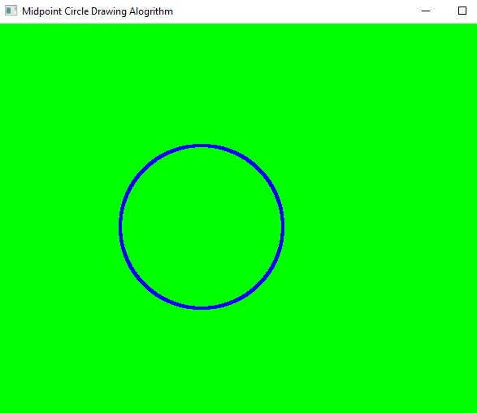
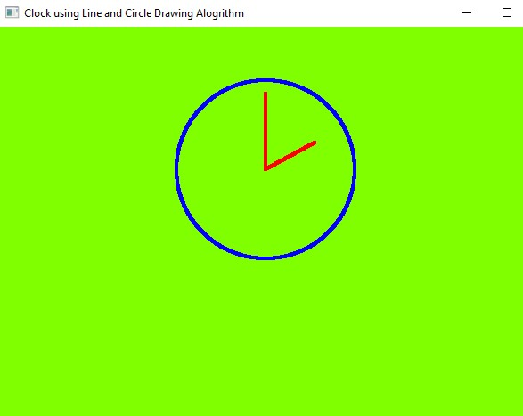

# circle_algorithm
### Midpoint Circle Drawing Algorithm in C++ using OpenGL 

#### a) To plot points that make up the circle with center (x ,y) and radius r using Midpoint circle drawing algorithm.

Co-ordinates of center of circle : (250, 230),  
 Radius: 100

#### b) To draw any object using line and circle drawing algorithms. (Clock)

Co-ordinates of center of circle : (300, 320),  
 Radius: 100
 
 

